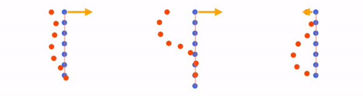
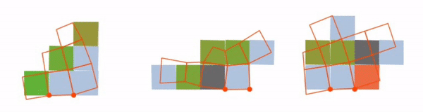
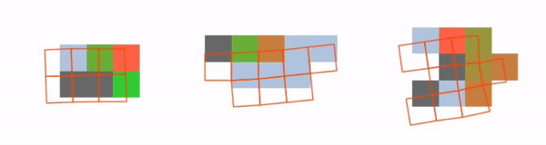

# Learning Compositional Koopman Operators for Model-Based Control

Yunzhu Li*, Hao He*, Jiajun Wu, Dina Katabi, Antonio Torralba

(* indicates equal contributions)

**ICLR 2020 (Spotlight)**
[[website]](http://koopman.csail.mit.edu/) [[openreview]](https://openreview.net/forum?id=H1ldzA4tPr) [[video]](https://youtu.be/MnXo_hjh1Q4)

Demo
-------------
#### Rope Manipulation
In this task, we manipulate a rope by applying forces to the top of it. The target shape is shown as red dots.
Note that in different cases, the number of rope masses, the gravity constant and the spring stiffness are different.

#### Soft Robot - Swing
Let's consider controlling a soft robot composed of boxes with different materials such as rigid tissue (gray color) and soft tissue (light blue color).
Some of the boxes have actuators which can perform contracting (red color) or expanding (green color). 
This task is to swing it to a target shape shown as red grids.

#### Soft Robot - Swim
This task is to make the soft robot swim forward to a target shape shown as red grids.

Installation
-------------
This codebase is tested with Ubuntu 16.04 LTS, Python 3.6+, PyTorch 1.2.0+, and CUDA 10.0.
Dependencies can be found in `requirements.txt`.

Play with Pre-trained Models
-------------
We provide pretrained models in the three environments as shown in the demo. The model parameteres are stored in the `dump_{env}/train_{env}_CKO_demo/net_best.pth`.

We provide the following scripts to run simulation with the pretained model. The result will be stored in `dump_{env}/eval_{env}_CKO_demo/`.

    bash scripts/eval_Rope.sh
    bash scripts/eval_Soft.sh
    bash scripts/eval_Swim.sh

We provide the following scripts to perform model-based control with the pretained model. The result will be stored in `dump_{env}/shoot_{env}_CKO_demo/`.

    bash scripts/mpc_Rope.sh
    bash scripts/mpc_Soft.sh
    bash scripts/mpc_Swim.sh

 

Train Your Own Models
-----

### Training
We also provide the scripts to train compositional koopman operators from scratch. 
**Note that if you are running the script for the first time**, it will start by generating training and validation data in parallel using `num_workers` threads. 
To aviod unnecessary data generation, you need to set `--gen_data 0` in the scripts, if the data has already been generated.

    bash scripts/train_Rope.sh
    bash scripts/train_Soft.sh
    bash scripts/train_Swim.sh

### Evaluation and Model-Based Control
You can simply use the scripts introduced in the previous section,`eval_{env}.sh` and `shoot_{env}.sh`, to evaluate the model you trained.
Do not the forget to change the argument `--eval_set` and `--shoot_set` to `valid`. It indicates evaluate your model on the validation data you generated instead of the demo data. 

Compare to the Koopman Baseline Method
---
We also provide an implementation of the baseline Koopman model using polynomial Koopman basis.
Just adding the argument `--baseline` to the above eval/mpc scripts, we can generate the simulation/control results for the Koopman baseline model.
For example, you can evaluate the Koopman baseline on the demo data we provided. The result will be stored in `dump_{env}/eval_{env}_KoopmanBaseline_demo/` and `dump_{env}/shoot_{env}_KoopmanBaseline_demo/`.  

Citing Our Paper
-----------------

If you find this codebase useful in your research, please consider citing:

    @inproceedings{
        li2020learning,
        title={Learning Compositional Koopman Operators for Model-Based Control},
        author={Yunzhu Li and Hao He and Jiajun Wu and Dina Katabi and Antonio Torralba},
        booktitle={International Conference on Learning Representations},
        year={2020},
        url={https://openreview.net/forum?id=H1ldzA4tPr}
    }
    
  For any questions, please contact Yunzhu Li (liyunzhu@mit.edu) and Hao He (haohe@mit.edu).

Related Work
---------------
Propagation Networks for Model-Based Control Under Partial Observation [(website)](http://propnet.csail.mit.edu/) [(code)](https://github.com/YunzhuLi/PropNet)